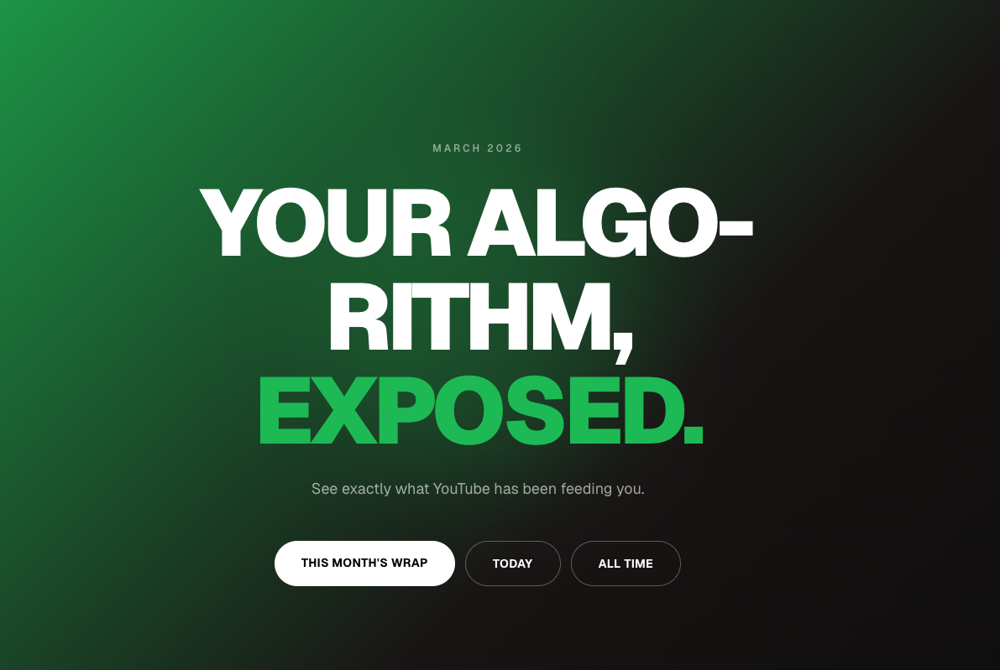

# Algomon — YouTube Algorithm Monitor

See exactly what YouTube is feeding you.

**Live:** https://algomon.kyle-jeffrey.com


## What It Is

A Chrome extension that scrapes YouTube recommendations as you browse, uploads them to a Cloudflare-hosted API, and displays them as a Spotify Wrapped-style analytics dashboard — word clouds, top videos, daily and monthly breakdowns.

## Stack

| Component | Tech |
|---|---|
| `extension/` | Chrome Extension (TypeScript, Manifest V3, Webpack) |
| `web/` | Next.js 15 App Router, Tailwind, Framer Motion, Cloudflare Pages + D1 |

## How It Works

1. Extension content script runs on `youtube.com`, listens for scroll events
2. Scrapes video titles/URLs from the DOM (`yt-lockup-view-model`, `ytm-shorts-lockup-view-model`, `ytd-compact-video-renderer`)
3. Deduplicates with an in-memory Set per session, POSTs directly to `/api/videos`
4. API upserts videos, increments `timesSeen`, extracts words from titles into the `words` table
5. Dashboard fetches from the API and renders word clouds + video lists

## Development

```bash
# Start everything (Next.js dev server + extension watch build)
./dev.sh
```

Or individually:

```bash
# Web (Next.js + Cloudflare D1 local)
cd web && npm run dev

# Extension (dev build — points to localhost:3000)
cd extension && npm run build -- --config webpack/webpack.dev.js

# Extension (watch mode)
cd extension && npm run watch
```

### Local D1 Database

```bash
# Apply migrations to local D1
cd web && npx wrangler d1 migrations apply algomon --local
```

### Load Extension in Chrome

1. Build the extension (`npm run build` or `npm run watch` in `extension/`)
2. Go to `chrome://extensions` → Enable Developer Mode → Load Unpacked → select `extension/dist/`

After any rebuild, click the reload icon on the extension card.

## Auth Setup

The extension authenticates with the API using a shared secret (`X-API-Key` header). You need to set this up before the extension can upload data.

### 1. Generate a secret

```bash
openssl rand -hex 32
```

### 2. Configure the web app

**Local dev** — create `.dev.vars`:
```
API_SECRET=<your-secret>
```

**Production** — set it as a Cloudflare secret (never goes in `wrangler.toml`):
```bash
npx wrangler secret put API_SECRET
```

### 3. Configure the extension

Create `extension/.env`:
```
API_SECRET=<your-secret>
```

Then rebuild the extension — the secret is baked into the bundle at build time:
```bash
cd extension && npm run build
```

> Both files are gitignored. Use the same secret value in both places.

## Deployment

Deployed to Cloudflare Workers via `@opennextjs/cloudflare`.

First-time setup:
```bash
# Create D1 database and paste the ID into wrangler.toml
npx wrangler d1 create algomon

# Apply migrations
npx wrangler d1 migrations apply algomon --remote

# Set API secret
npx wrangler secret put API_SECRET
```

Deploy:
```bash
npm run cf:deploy
```

## TODO

- [ ] Add a tracker for videos watched and time spent watching — break up browsing time vs watch time (`timesWatched` column already exists in the schema)
- [ ] Track word/video trends over time (e.g. a word appearing more this week than last)
- [ ] Possibly grab video tags from the YouTube page for richer analysis
- [ ] Real user auth — currently uses a shared API key + localStorage username picker (no passwords)
- [ ] Add sharing of word clouds
- [ ] Add a comparison view to see how your recommendations differ from other users (e.g. friends, global average) / compatability 

