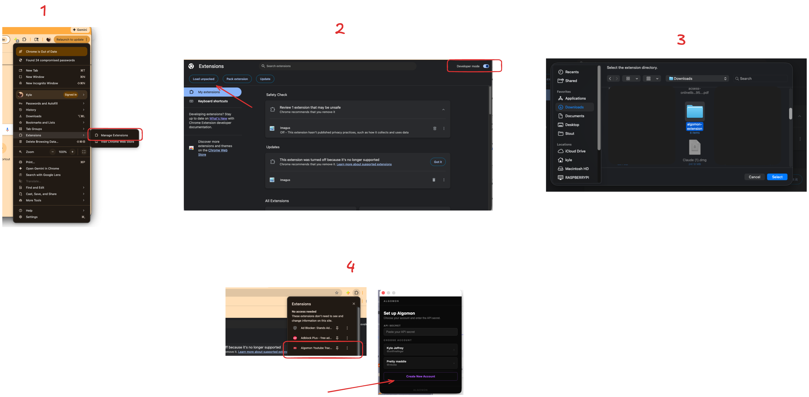

# Setting up extension.

Download here -> https://github.com/KyleAlanJeffrey/algomon/releases/download/latest/algomon-extension.zip.

Unzip the file.

Open the extensions page in Chrome by going to `chrome://extensions/`.

Enable developer mode by toggling the switch in the top right corner.

Click "Load unpacked" and select the unzipped folder.

The extension should now be installed and ready to use! You can click on the extension icon in the toolbar to open it.

Use the provided API_SECRET and create a new account.